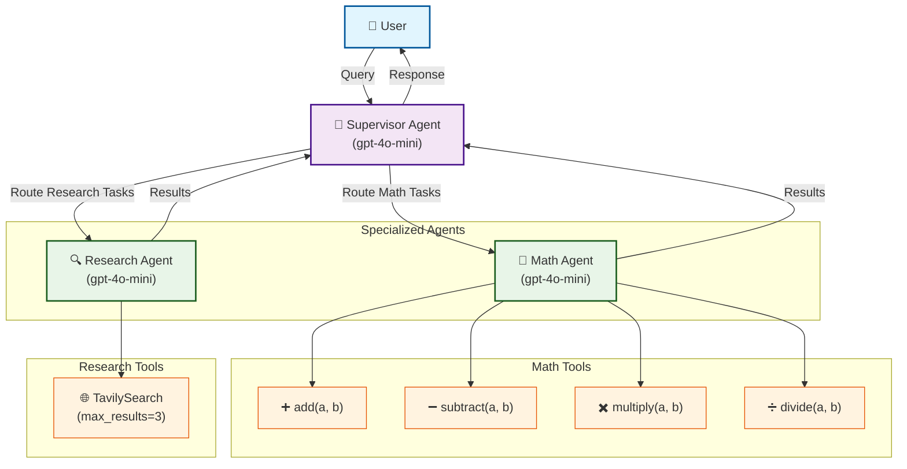

# Agent-supervisor

A multi-agent system built with LangGraph (via DeepAgents' `SubAgentMiddleware`)
using a **supervisor pattern**. A supervisor routes user queries to specialized
sub-agents, and the whole system is instrumented with Braintrust for evals,
observability, and an automated self-improvement flywheel. All agents default to
`gpt-4o-mini`, routed through the Braintrust Gateway.

**Braintrust project:** `agent-supervisor`

---

## Agents

The supervisor is defined in `src/agents/deep_agent.py` (`get_supervisor()`) and
delegates to two specialized sub-agents. Prompts and routing descriptions live in
`prompts/` and are wired through `src/config.py` (`AgentConfig`).

| Agent | File | Tools | Role |
|-------|------|-------|------|
| **Supervisor** | `src/agents/deep_agent.py` | (routing) | Routes each query to the right sub-agent(s), or answers simple/conversational queries directly. |
| **Math Agent** | `src/agents/math_agent.py` | `add`, `subtract`, `multiply`, `divide` | Arithmetic, equations, and numerical computation. |
| **Research Agent** | `src/agents/research_agent.py` | Tavily web search | Factual lookups, current events, and information retrieval. |

## 🏗️ Architecture Diagram



---
## 1. Prompts

- Prompts live in the `prompts/` directory, split by agent. You can manually push prompts to Braintrust

```bash
bt functions push prompts/push_prompts.py --if-exists replace -p agent-supervisor
```

## 2. Evals

Eval scripts live in `evals/` and run against Braintrust [datasets](https://www.braintrust.dev/docs/annotate/datasets/create). Prompts and
models are parameterized via `evals/parameters.py`

This is so [experiments](https://www.braintrust.dev/docs/evaluate/run-evaluations) comparing prompts or models can be
driven from the Braintrust UI. The saved parameter configs are pushed to Braintrust with:

```bash
bt functions push evals/parameters.py --if-exists replace -p agent-supervisor
```

Datasets support tag-based filtering via the
`EVAL_TAG` env var.

| Eval | File | Focus |
|------|------|-------|
| **Supervisor** | `eval_supervisor.py` | Routing accuracy, response quality, step efficiency (the main eval). |
| **Math Agent** | `eval_math_agent.py` | Calculation accuracy and correct tool usage. |
| **Research Agent** | `eval_research_agent.py` | Web search usage and source attribution. |
| **Gateway Model Matrix** | `eval_gateway_model_matrix.py` | Compares multiple Gateway-routed models on routing/quality (reuses supervisor scorers by slug). Excluded from CI to avoid expensive sweeps. |

---

## 3. Scorers

- Scorer logic lives in the `scorers/` directory, split by agent:
(`supervisor.py`, `math.py`, `research.py`) and exported from
`scorers/__init__.py`. 
- `scorers/push_scorers.py` registers all 12 with Braintrust
via `project.scorers.create`. LLM-as-a-judge scorers use `gpt-4o` through the
[Gateway](https://www.braintrust.dev/docs/deploy/gateway); the rest are deterministic code scorers.

**Supervisor** (`scorers/supervisor.py`)
- **Routing Accuracy** — trace-based; checks the query reached the right agent(s).
- **Response Quality** — LLM judge (slug `response-quality`).
- **Step Efficiency** — bundled code scorer (slug `step-efficiency-bundled`).

**Math** (`scorers/math.py`)
- **Calculation Accuracy** — expected answer appears in the final response.
- **Tool Usage** — a valid math tool (`add`/`subtract`/`multiply`/`divide`) was used.
- **Efficiency** — penalizes excess tool calls.
- **Response Format** — output formatting check.
- **Calculation Correctness** — LLM judge.

**Research** (`scorers/research.py`)
- **Web Search Usage** — search tool was invoked when appropriate.
- **Source Attribution** — response includes a URL citation.
- **Efficiency** — ideal is 1–2 searches; penalizes excessive searching.
- **Answer Quality** — LLM judge.

You can also manually push scorers to Braintrust; most teams prototype in the UI, then push production-ready scorers via the CLI. See Scorers overview for guidance.

```bash
bt functions push scorers/push_scorers.py --if-exists replace -p agent-supervisor
```

---

## Quickstart

### 1. Environment Setup

Create a `.env` file in the project root:

```env
OPENAI_API_KEY=your_openai_api_key_here
TAVILY_API_KEY=your_tavily_api_key_here
BRAINTRUST_API_KEY=your_braintrust_api_key_here
ENDPOINT_AUTH_TOKEN=your_long_random_token
```

### 2. Run locally

```bash
python -m src.local_runner
```

### Run evals locally (source `.env` first so the CLI authenticates):

```bash
set -a && source .env && set +a
.venv/bin/braintrust eval evals/                  # all evals
.venv/bin/braintrust eval evals/eval_supervisor.py # one eval
EVAL_TAG=production .venv/bin/braintrust eval evals/eval_supervisor.py  # a slice
```

---

## CI/CD

Four GitHub Actions workflows (`.github/workflows/`) form a closed
**production → evaluation → improvement** flywheel. 

Note, the CI/CD crons are offset from `:00` to
dodge GitHub's contended top-of-hour scheduler slot.

| Workflow | File | Trigger | Purpose |
|----------|------|---------|---------|
| **Run Python evals** | `ci.yml` | push/PR (on `evals/`, `src/`, deps) + daily `14:11 UTC` | Runs the three agent evals via `braintrustdata/eval-action`, gating changes and bot PRs. |
| **Daily trace generation** | `run_on_schedule.yml` | daily `15:23 UTC` | Runs `scripts/run_queries.py` to feed fresh production traces into Braintrust. |
| **Self-Improving Flywheel** | `flywheel.yml` | every other day `16:37 UTC` | Claude Code + the `bt-flywheel` skill analyze the last 24h of traces and open an optimization PR (or a follow-up issue) against the eval-gated baseline. |
| **Push Braintrust definitions** | `push-braintrust.yml` | push to `main` (on `scorers/`, `prompts/`, `evals/parameters.py`, `src/config.py`, deps) + manual | Publishes scorers, prompts, and eval parameters to Braintrust via `bt functions push` so the server-side copies never drift from source. |

**The loop:**
1. `run_on_schedule.yml` generates traces from real queries each morning.
2. `flywheel.yml` analyzes those traces, proposes prompt/config changes, and
   opens a PR (PR creation requires repo workflow permissions; it refuses to
   touch `.github/workflows/` files itself).
3. `ci.yml` runs the evals on that PR — improvements must clear the scorers
   before a human merges.
4. On merge, `push-braintrust.yml` publishes the updated prompts, scorers, and
   eval parameters back to Braintrust, keeping the server-side definitions in
   sync with `main`.


Required secrets: 
- `BRAINTRUST_API_KEY`
- `OPENAI_API_KEY`
- `TAVILY_API_KEY`,
- `ANTHROPIC_API_KEY`

The flywheel uses `claude-haiku-4-5` for cost.

The flywheel also traces Claude Code's own runs to a separate agent-supervisor-claude-code Braintrust project, and can open a follow-up issue 
